# Dhaka Tesla Pool

**Share a seat. Split the fare. Survive Dhaka traffic.**

A ride-pooling MVP. Passengers ask for a ride between two areas of Dhaka. A driver with a Tesla (Bullet, three seats) accepts, other passengers heading out from the same area are pooled into the same car automatically, and everybody pays a discounted fare. The interesting part is not the screens, it is that the system stays correct when several people grab the last seat at the same moment.

- Demo video: [watch it on Google Drive](https://drive.google.com/file/d/1hPH7zXlHSNkvcnsKhCqQ21oPuTOywFrr/view?usp=sharing)
- Run it: `cp .env.example .env && docker compose up --build`, then open <http://localhost:3000> (see [Docker](#docker-the-main-way-to-run-it))

## Problem statement

Getting across Dhaka means slow traffic and, for a solo rider, a fare that pays for the whole car. Drivers often travel with empty seats. Pooling fixes both: riders going the same way share the car and the cost.

Pooling is also a textbook concurrency problem. Two passengers can ask for the last seat in the same millisecond, a driver can go offline while a request is being accepted, and a passenger can cancel while the driver starts the ride. Naive code double-books seats, loses updates or deadlocks. This project treats those cases as the main requirement and proves them with tests.

## Features

**Passenger**
- Sign up, log in, log out (passenger accounts only).
- Request a ride: pickup area, destination area, 1 to 3 seats. One active request at a time.
- If an open ride at the same pickup has room, the passenger joins it immediately; otherwise the request waits for a driver.
- Track the request live (status badge, driver and vehicle, estimated fare, final fare once the ride starts). Cancel while it is `REQUESTED` or `MATCHED`.
- See their own fare history. Never anybody else's.

**Driver**
- Go online or offline (not while a ride is active).
- See open requests, accept one to start a ride in their Bullet.
- Run the ride: Arrive, Start, Complete, or Cancel ride. Only the valid buttons are shown.
- Seat indicator for Bullet (for example 2 of 3 seats taken), passenger list, past rides. Drivers never see fares.

**Platform**
- Two explicit state machines (request and ride) with an audit row for every transition.
- Fares in integer paisa, 20% pool discount fixed when the ride starts.
- Atomic seat claims, lock ordering, database-enforced invariants.
- Per-account login rate limiting (only failed attempts count), helmet, structured request logs with cookies redacted.

## Screenshots

| | |
|---|---|
| 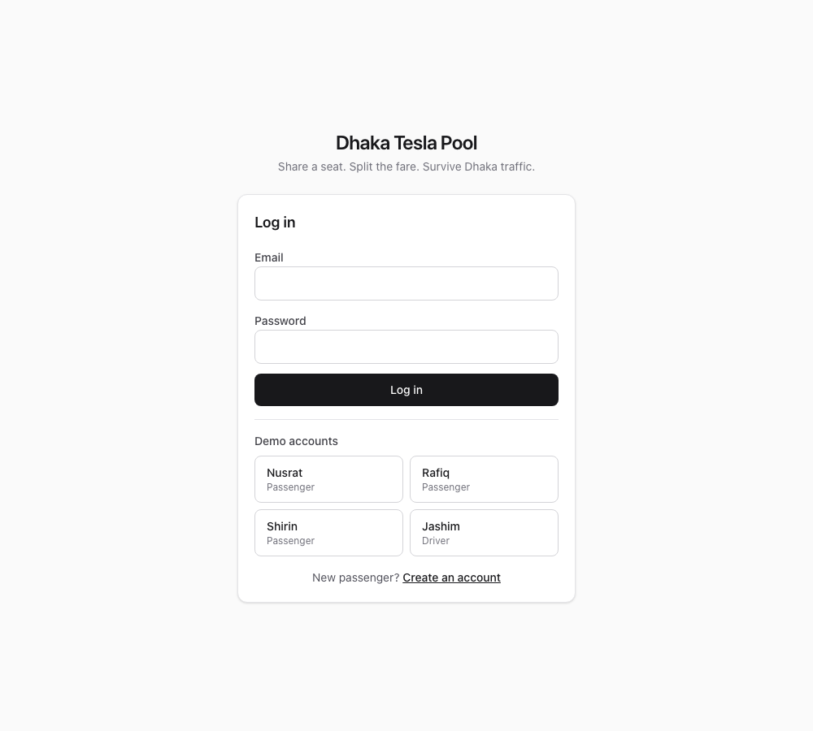 | 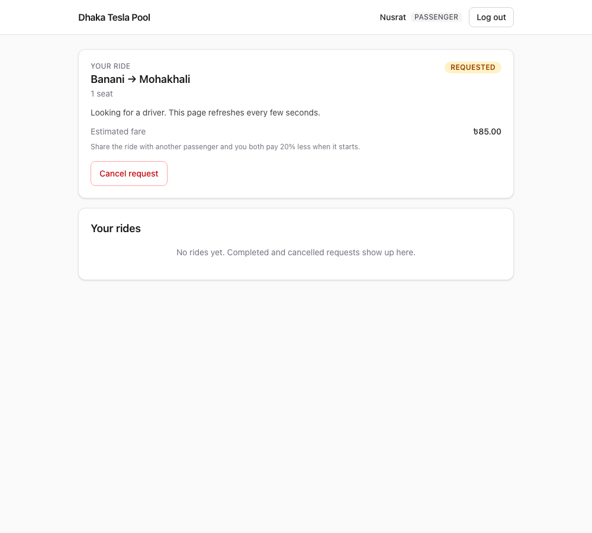 |
| **1. Login**, with quick-login buttons for the demo cast | **2. Nusrat's request** waits for a driver |
| 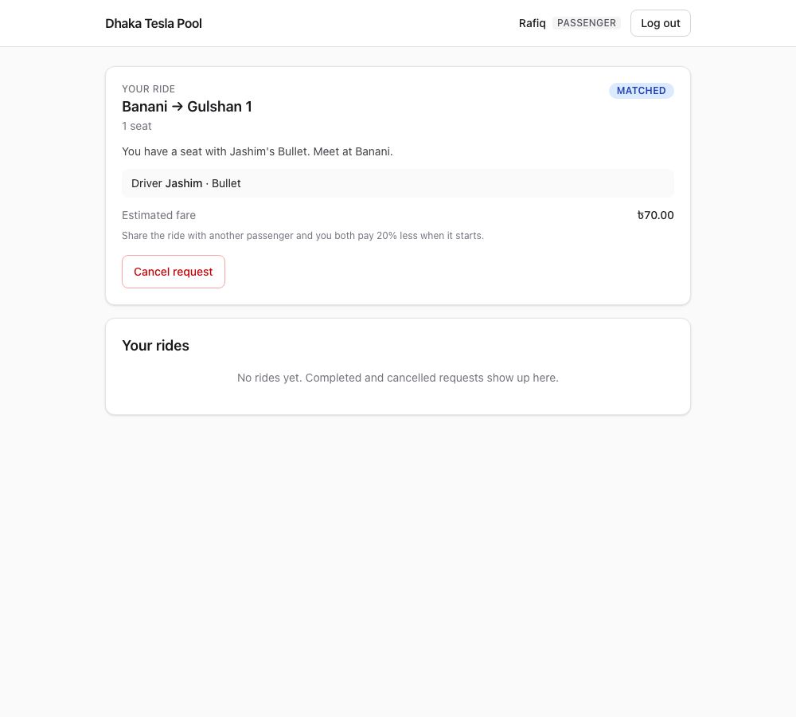 | 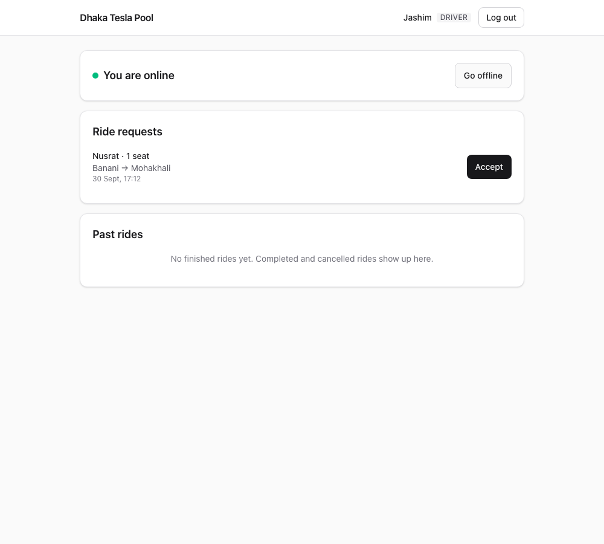 |
| **3. Rafiq joins the open ride** and is matched straight away | **4. Jashim's open requests**, each with an Accept button |
| 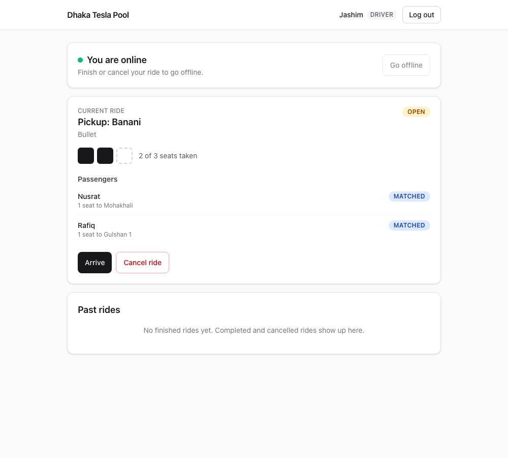 | 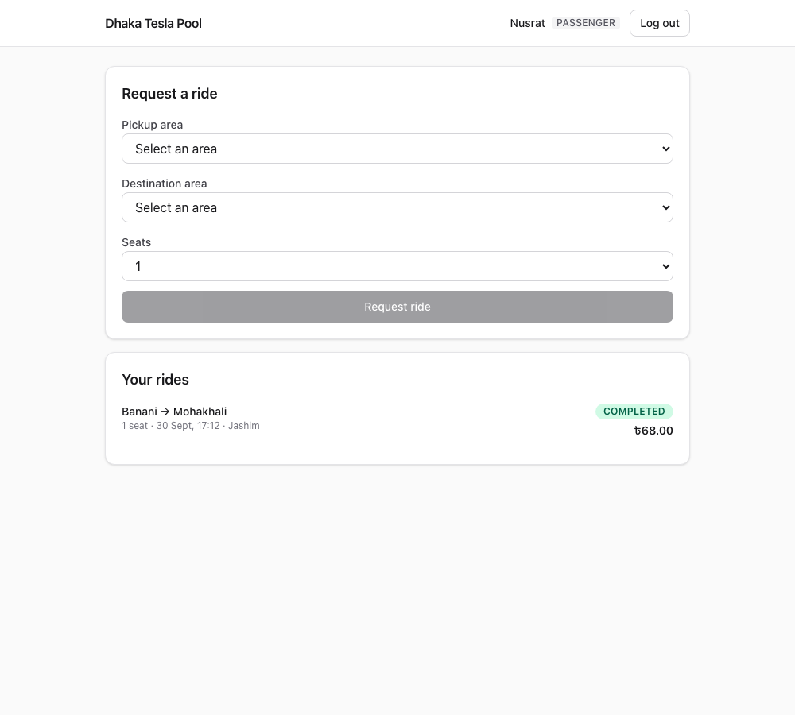 |
| **5. The pooled ride**: 2 of Bullet's 3 seats taken | **6. Nusrat's completed ride**: ৳68.00 |

On a phone (390px wide):

| | | |
|---|---|---|
| 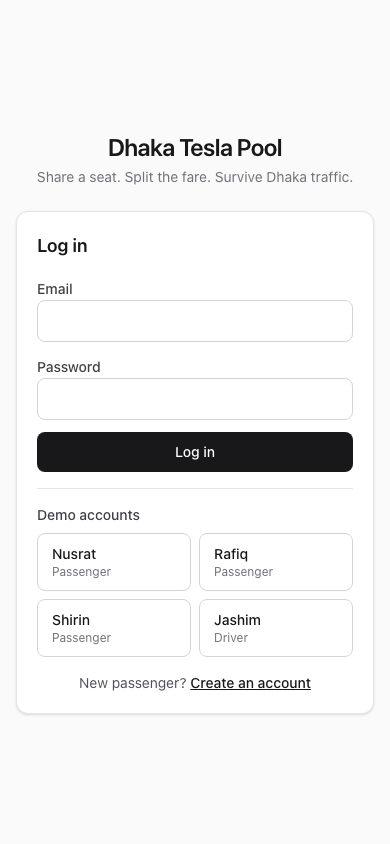 | 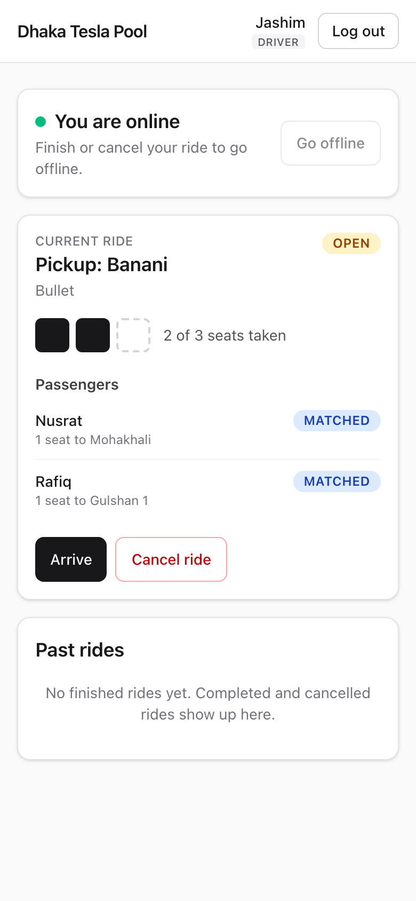 | 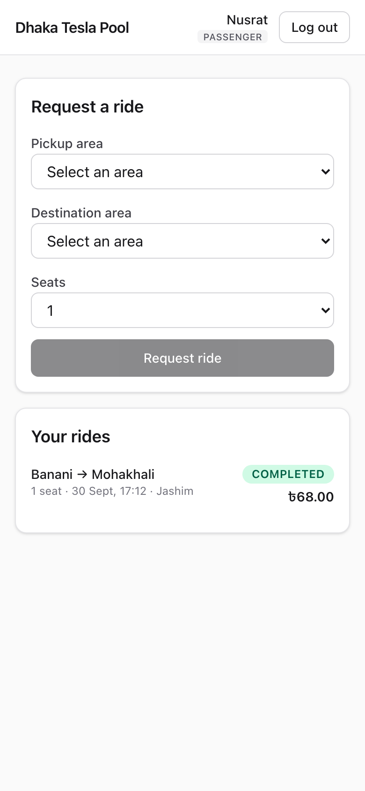 |

They are produced by the end-to-end test (`cd web && npm run test:e2e`), so they always match the real app.

## Architecture

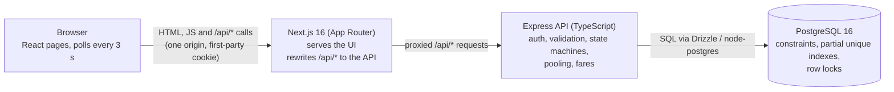

The browser only ever talks to the Next.js origin. Next proxies `/api/*` to the API, so the session cookie is first-party and CORS never comes into play. All business rules live in the API and the database; the UI holds no rules, it renders what the API says and offers the buttons the API would accept.

## Data model

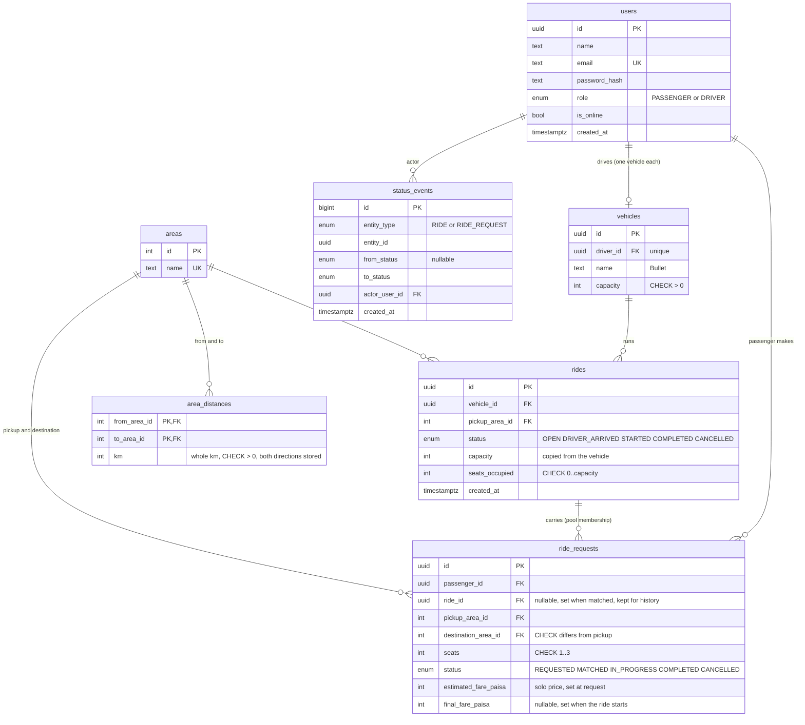

Two partial unique indexes carry business rules: `rides_one_active_per_vehicle_idx` (a vehicle has at most one ride in `OPEN`, `DRIVER_ARRIVED` or `STARTED`) and `ride_requests_one_active_per_passenger_idx` (a passenger has at most one request in `REQUESTED`, `MATCHED` or `IN_PROGRESS`).

## Tech stack

| Layer | Choice | Why | Alternatives | When to switch |
|---|---|---|---|---|
| API | Node.js, Express 5, TypeScript | Small, well known, async errors propagate without wrappers in Express 5 | Fastify, NestJS | Fastify for raw throughput; NestJS once the team and module count grow and you want enforced structure |
| Validation | Zod | One schema gives runtime validation and static types | Valibot, AJV | AJV if you already have JSON Schema contracts to share |
| ORM and queries | Drizzle ORM with node-postgres | SQL-shaped, typed, easy to drop to exact SQL for the atomic statements | Prisma, Kysely | Prisma for a bigger team that values generated tooling over SQL control; Kysely for a pure query builder |
| Database | PostgreSQL 16 | CHECK constraints, partial unique indexes and row locks are exactly what pooling correctness needs | MySQL, CockroachDB | CockroachDB or sharding only when one primary can no longer take the write load |
| Web | Next.js 16 (App Router), React 19, Tailwind 4 | One repo for pages and the `/api` proxy, standalone output for Docker | Vite + React SPA, Remix | A plain SPA behind any static host if server rendering is never needed |
| Auth | bcryptjs, JWT (HS256) in an httpOnly cookie | Stateless, no server session store, cookie is not readable by scripts | Server sessions, OAuth/OIDC | Server-side sessions when you need instant revocation; OIDC for social login |
| Logging | pino, pino-http | Fast structured logs, cookies and auth headers redacted | winston | Only if you need its transports |
| API tests | Vitest, Supertest, real Postgres | Pooling bugs only show up against a real database, so nothing is mocked | Jest | Jest if the org already standardises on it |
| Browser test | Playwright | Real browsers, several contexts in one test (two passengers and a driver) | Cypress | Cypress for its time-travel debugging |
| Packaging | Docker, docker compose | The reproducible way to run all three pieces together | Kubernetes, Nomad | Kubernetes once you need several replicas and rolling deploys |

## Project structure

```
.
├── api/                      Express API
│   ├── src/
│   │   ├── app.ts            builds the Express app (no listen, so tests can import it)
│   │   ├── index.ts          calls listen
│   │   ├── env.ts            the only place environment variables are read
│   │   ├── errors.ts         AppError
│   │   ├── auth/             JWT cookie handling
│   │   ├── db/               schema.ts, client.ts, migrate.ts, seed.ts
│   │   ├── domain/           stateMachine.ts, fare.ts, pool.ts, rideLifecycle.ts (pure rules + transactions)
│   │   ├── middleware/       auth guards, validation, errors, rate limits
│   │   └── routes/           auth, areas, requests (passenger), driver
│   ├── drizzle/              generated SQL migrations (never edited once committed)
│   ├── tests/                Vitest + Supertest against a real test database
│   ├── Dockerfile
│   └── docker-entrypoint.sh  migrate, seed, start
├── web/                      Next.js app
│   ├── src/app/              login, signup, passenger, driver pages
│   ├── src/components/       header, status badge, small UI kit
│   ├── src/lib/              typed API client, money formatting, session guard, polling hook
│   ├── e2e/                  Playwright smoke test (also regenerates the screenshots)
│   └── Dockerfile
├── docs/screenshots/         generated by the e2e test
├── docker-compose.yml        db + api + web, with health checks
├── .env.example              every variable, documented
├── AI_NOTES.md               AI usage log
└── README.md
```

## Environment variables

Copy `.env.example` to `.env`. Docker compose reads it for the whole stack; the API reads it when you run it on your machine. The web app has no variables of its own.

| Variable | Default in `.env.example` | What it does |
|---|---|---|
| `POSTGRES_USER`, `POSTGRES_PASSWORD`, `POSTGRES_DB` | `tesla`, `tesla_dev_password`, `tesla_pool` | Database that compose creates. Keep the password URL-safe: it is embedded in `DATABASE_URL`. |
| `DB_PORT` | `5433` | Port Postgres is published on your machine. Inside compose the API always uses `db:5432`. |
| `DATABASE_URL` | `postgres://tesla:…@localhost:5433/tesla_pool` | Used when the API runs outside Docker. Compose builds its own from the `POSTGRES_*` values. |
| `TEST_DATABASE_URL` | `…/tesla_pool_test` | The tests' database. The name must end in `_test`; under `NODE_ENV=test` anything else is refused. |
| `JWT_SECRET` | placeholder | Required; the API refuses to start without it (tests use a built-in default). Use a long random value outside a local demo. |
| `COOKIE_SAMESITE` | `lax` | `lax`, `strict` or `none`. |
| `COOKIE_SECURE` | `false` | Set `true` only when the site is served over HTTPS. |
| `TRUST_PROXY` | `false` | Believe `X-Forwarded-For` for the client IP: `false`, a hop count, or an address list. Only enable behind a real reverse proxy; see [rate limiting](#key-decisions-and-trade-offs). |
| `API_PORT` | `4000` | Port the API listens on (fixed at 4000 inside compose). |
| `WEB_ORIGIN` | `http://localhost:3000` | CORS origin for direct API calls. The browser does not need it because it goes through the Next proxy. |
| `API_URL` (web, build time) | `http://localhost:4000`; `http://api:4000` in Docker | Where Next proxies `/api/*`. Next resolves rewrites while building, so changing it needs a rebuild. |

## Local setup

You need Node 26 (what it was developed and tested on; the Docker images use it too) and Docker for Postgres.

```bash
cp .env.example .env
docker compose up -d db          # Postgres on localhost:5433

cd api
npm ci
npm run db:migrate               # apply migrations
npm run db:seed                  # demo cast, Bullet, areas and distances
npm run dev                      # API on http://localhost:4000

cd ../web                        # in a second terminal
npm ci
npm run dev                      # UI on http://localhost:3000
```

## Docker: the main way to run it

```bash
cp .env.example .env
docker compose up --build
```

Then open <http://localhost:3000> and use the quick-login buttons.

- Three services start in order, each waiting for the previous one's health check: `db` (Postgres, `pg_isready`), `api` (`GET /health`), `web` (`GET /login`).
- When the `api` container starts it applies the migrations, runs the idempotent seed, and only then starts the server. Restarting it is safe.
- Both application images are multi-stage and run as a non-root user. The API image contains production dependencies only; the web image uses Next's standalone output.
- The browser talks to `http://localhost:3000` only. The web image was built with `API_URL=http://api:4000`, so `/api/*` reaches the API service on the compose network.
- `docker compose down -v` removes the containers and the database volume.

There is no public deployment; see [Deployment](#deployment) for why, and for how to run the project.

## Deployment

There is **no public deployment and no live URL.** I tried the free backend hosts available to me, Render and Hugging Face Spaces. They either required card verification or were unavailable, and the brief forbids paid infrastructure, so the project is not hosted anywhere.

**Docker Compose is the reproducible deployment.** On any machine with Docker:

```bash
cp .env.example .env && docker compose up --build
```

Then open <http://localhost:3000> and use the demo quick-login buttons (Nusrat, Rafiq, Shirin and Jashim). One command starts Postgres, the API (which applies the migrations and the seed when it starts) and the web app, each waiting for the previous one's health check. This was verified from a fresh clone of the repository, including the full pooled-ride story running against the containers; the details are in [the Docker section above](#docker-the-main-way-to-run-it).

## Migrations and seed

- Schema lives in `api/src/db/schema.ts`. `npm run db:generate` writes a new SQL migration into `api/drizzle/`; committed migrations are never edited, every change is a new one (there are four so far). `npm run db:migrate` applies them.
- `npm run db:seed` is idempotent (safe to run twice) and creates: the 9 areas, all 72 directed distances (36 pairs, stored in both directions, whole km, with Banani to Mohakhali = 3 and Banani to Gulshan 1 = 2), the four demo users, and Bullet (capacity 3) owned by Jashim.
- In Docker the `api` container does both of these on startup.

## Demo credentials

Every demo account uses the password **`tesla1234`**.

| Person | Email | Role |
|---|---|---|
| Jashim (owns Bullet, capacity 3) | `jashim@teslapool.dev` | Driver |
| Nusrat | `nusrat@teslapool.dev` | Passenger |
| Rafiq | `rafiq@teslapool.dev` | Passenger |
| Shirin | `shirin@teslapool.dev` | Passenger |

## Running the tests

**API (Vitest + Supertest, real Postgres, nothing mocked).** 168 tests in 11 files.

```bash
cp .env.example .env             # if you have not already
docker compose up -d db
cd api && npm test
```

The test setup creates `tesla_pool_test` if needed, applies the migrations, seeds it, and runs the files one after another. It can never touch the development database: under `NODE_ENV=test` only a database whose name ends in `_test` is accepted, and the destructive reset helper refuses to run otherwise.

**End to end (Playwright).** One test runs the whole story in real browsers: Nusrat requests, Jashim accepts, Rafiq joins automatically, the ride runs to completion, and each passenger sees only their own fare (৳68.00 and ৳56.00). It also regenerates `docs/screenshots/`.

```bash
cd web
npx playwright install chromium   # first time only
npm run test:e2e
```

Note: the e2e test uses the **development** database (and starts the API and a production build of the web app if they are not already running), so it leaves ride history and Jashim online. Reset to seed data with:

```sql
BEGIN;
TRUNCATE status_events, ride_requests, rides RESTART IDENTITY;
DELETE FROM users WHERE email NOT IN ('jashim@teslapool.dev','nusrat@teslapool.dev','rafiq@teslapool.dev','shirin@teslapool.dev');
UPDATE users SET is_online = false;
COMMIT;
```

```bash
docker compose exec -T db psql -U tesla -d tesla_pool   # then paste the SQL above
```

## API overview

All bodies are JSON. Every error has one shape: `{ "error": { "code": "STRING_CODE", "message": "..." } }`. Responses never contain `password_hash`.

| Method | Path | Who | What |
|---|---|---|---|
| GET | `/health` | public | Liveness |
| POST | `/auth/signup` | public | Create a passenger; sets the session cookie. `409 EMAIL_TAKEN` |
| POST | `/auth/login` | public | Sets the cookie. Wrong email or password give the same `401 INVALID_CREDENTIALS` |
| POST | `/auth/logout` | anyone | Clears the cookie (204) |
| GET | `/auth/me` | signed in | Current user, including `is_online` |
| GET | `/areas` | signed in | Areas sorted by name |
| POST | `/requests` | passenger | Ask for a ride. Joins a compatible open ride or waits. `409 ACTIVE_REQUEST_EXISTS` |
| GET | `/requests` | passenger | My requests, newest first |
| GET | `/requests/:id` | passenger | One of my requests; somebody else's is `404` |
| POST | `/requests/:id/cancel` | passenger | Cancel while `REQUESTED` or `MATCHED`, releasing seats |
| POST | `/driver/online`, `/driver/offline` | driver | Toggle availability; offline with an active ride is `409 HAS_ACTIVE_RIDE` |
| GET | `/driver/requests` | driver | Open requests, oldest first, no fares. `409 DRIVER_OFFLINE` when offline |
| POST | `/driver/requests/:id/accept` | driver | Create a new ride for that request. `409 REQUEST_UNAVAILABLE`, `409 VEHICLE_HAS_ACTIVE_RIDE` |
| GET | `/driver/ride` | driver | Current ride with passengers, or `null` |
| GET | `/driver/rides` | driver | Finished rides with passenger count and seats used |
| POST | `/driver/ride/arrive`, `/start`, `/complete`, `/cancel` | driver | Move the ride. `409 INVALID_TRANSITION`, `409 RIDE_EMPTY` |

Other codes: `VALIDATION_ERROR` (400), `INVALID_JSON` (400), `UNAUTHENTICATED` (401), `FORBIDDEN` (403), `NOT_FOUND` (404), `PAYLOAD_TOO_LARGE` (413), `RATE_LIMITED` (429), `NOT_ENOUGH_SEATS` (409), `VEHICLE_HAS_ACTIVE_RIDE` (409), `INTERNAL_ERROR` (500, no detail leaked).

## State machines

All transition rules live in one module, `api/src/domain/stateMachine.ts`. A disallowed move is always `409 INVALID_TRANSITION` with a message such as "Cannot move ride request from COMPLETED to MATCHED". Every transition of either machine inserts a row into `status_events` (what, from, to, who, when).

**Ride request (one per passenger)**

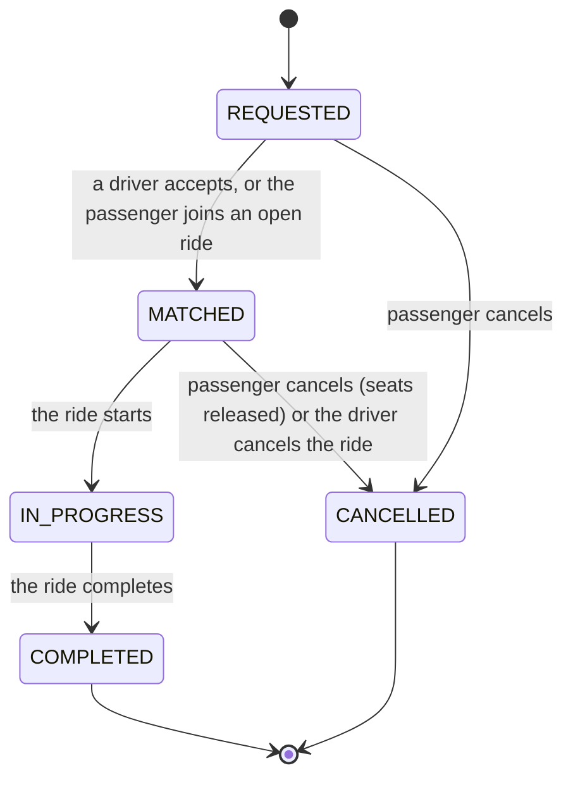

**Ride (the Tesla trip, the pool)**

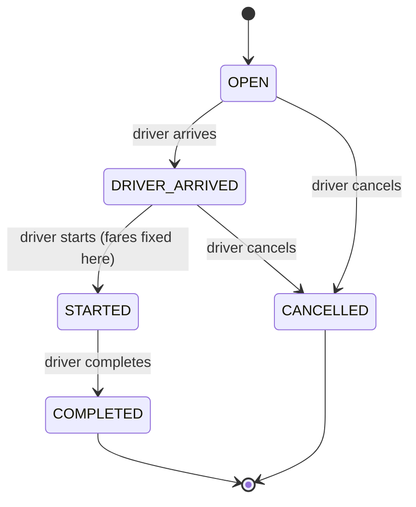

When a ride starts, its `MATCHED` requests become `IN_PROGRESS`; when it completes, `COMPLETED`. When the driver cancels, its `MATCHED` requests become `CANCELLED` and those passengers can ask again.

## Matching rule

1. A passenger creates a request (pickup, destination, 1 to 3 seats).
2. In the same transaction the API looks for a ride that is `OPEN` or `DRIVER_ARRIVED`, has the same pickup area, was created in the last 10 minutes, and has enough free seats. Oldest first. For each candidate it tries to claim the seats atomically; on success the request is stored as `MATCHED` into that ride, otherwise the next candidate is tried.
3. If nothing fits, the request is stored as `REQUESTED` and shows up for online drivers.
4. An online driver with no active ride accepts a `REQUESTED` request: a new `OPEN` ride is created on their vehicle, the seats are claimed, and the request becomes `MATCHED`.

## Fare model

Money is always integer **paisa**, never a float.

```
solo fare = (4000 + 1500 × km) × seats
pool discount = 20% off, applied when 2 or more separate passenger requests ride together at the moment the ride STARTS
discount amount = Math.round(solo fare × 20 / 100)
```

The discount is about **passengers, not seats**: one passenger with two seats rides alone and pays full price. `estimated_fare_paisa` is the solo price, set when the request is made. `final_fare_paisa` is set when the ride starts, from the requests that are `MATCHED` at that moment; a passenger who cancelled before the start does not count.

Worked example, straight from the tests:

| Passenger | Route | Distance | Solo fare | Pooled with one other | Stored |
|---|---|---|---|---|---|
| Nusrat | Banani to Mohakhali | 3 km | 4000 + 1500 × 3 = 8500 | 8500 − 1700 = **6800** | ৳68.00 |
| Rafiq | Banani to Gulshan 1 | 2 km | 4000 + 1500 × 2 = 7000 | 7000 − 1400 = **5600** | ৳56.00 |

If either of them rides alone, they pay 8500 or 7000 with no discount.

### Why integer paisa

Floats cannot represent most decimal amounts exactly (0.1 + 0.2 is not 0.3), so sums and percentages drift by fractions of a paisa and amounts stop being comparable. Whole paisa in an `integer` column are exact, add up exactly, and can be compared with `=`. The fare code rejects non-integer inputs, rounding happens in exactly one place (the discount), and the UI turns paisa into `৳68.00` with integer arithmetic only, at display time.

## Concurrency and correctness

This is the core of the project. The rules, and how each one is proven:

**1. One atomic statement for the seat claim.** Claiming seats is a single conditional `UPDATE` (`status` is joinable and `seats_occupied + n <= capacity`, returning the row). If no row comes back the seats are gone. There is never a read followed by a write. The claim, the request insert or update, and the status events happen in one transaction. As a second line of defence the table has `CHECK (seats_occupied >= 0 AND seats_occupied <= capacity)`, so even a bug cannot exceed Bullet's capacity.

**2. Invariants live in the database.** Partial unique indexes enforce "one active ride per vehicle" and "one active request per passenger". A violation (Postgres `23505`) is mapped to a clear `409`; the error handler walks the Drizzle error's cause chain to find the driver error, and only named constraints are mapped (anything else stays a generic 500).

**3. Lock order: the ride first, then its requests.** Any transaction that touches a ride and its requests locks the ride row first (`SELECT ... FOR UPDATE`, or the seat-claim `UPDATE`), then the requests.

- *The deadlock challenge.* Driver start locks the ride then its requests; passenger cancel used to lock the request then the ride. Run together they deadlock, and Postgres kills one of them. A test with a stand-in for ride start reproduced it (the cancel came back as a 500 after about a second); with the lock order fixed it finishes in about 0.1 s.
- Reading the fix closely turned up a narrow hole: cancel reads the request's `ride_id` first to know which ride to lock, so a request matched *between* that read and the update would be locked in the wrong order. The transaction detects it (the update returns a ride it did not lock), rolls back, and retries with the ride locked first.
- *Proof.* `start` racing with Nusrat's `cancel`, 10 rounds with fresh setup and alternating who is issued first, never returns a 500 and always ends consistent (either she is `IN_PROGRESS` at the pooled fare, or `CANCELLED` with her seat released and Rafiq alone at the full fare). I also checked the test has teeth: with `start` temporarily locking requests before the ride, it failed in 5 of 5 runs ("start 500, cancel 200").

**4. The offline/accept stale-snapshot challenge.** A driver can go offline while accepting a request. The first fix, locking the driver's row inside `accept`, was not enough: "go offline" was a single `UPDATE ... WHERE NOT EXISTS (active ride)`, and that subquery is evaluated once, with the statement's snapshot, before the statement waits for the row lock. If accept held the lock first, offline waited, accept committed, and offline then resumed with its stale "no active ride" and went offline anyway. The race test failed 6 out of 6 times ("accept 200, offline 200": a driver offline with an active ride). The fix: offline also takes the row lock first, in its own statement, so the check that follows runs with a fresh snapshot that already contains the new ride. After that it passed 10 of 10 runs (200 rounds).

**5. The last-seat race.** Bullet has one seat left (a ride with 2 of 3 seats occupied). Nusrat and Shirin `POST /requests` at the same moment (`Promise.all`). Exactly one ends `MATCHED`, the other `REQUESTED`, and `seats_occupied` is exactly 3. Repeated 10 times with fresh setup, alternating who goes first. The teeth check: I temporarily replaced the atomic claim with a naive read-then-write version and the test failed in 4 of 4 runs, with both passengers `MATCHED` (overbooking).

The same style of test covers two simultaneous cancels of one request (one wins, the seat is released once) and two concurrent claims straight on the claim function.

## Key decisions and trade-offs

- **State machine in one module, rules derived once.** The set of cancellable request statuses and of active and finished ride statuses are derived from the transition tables, so a rule is defined in a single place. The one exception is SQL: the partial indexes list their statuses literally, so those must be kept in step by hand.
- **Fares fixed at ride start, discount by passenger count.** Fares cannot change under a passenger after the ride begins, and the discount is fair (it does not reward booking more seats).
- **Matching happens at request time.** There is no background matcher: a passenger joins an open ride when they ask, or a driver accepts. It is simple and deterministic; the trade-off is that a request made *before* any ride exists waits for a driver instead of auto-joining a ride created a minute later.
- **Same-origin proxy, first-party cookie.** The session cookie is `httpOnly` and first-party because the browser only talks to Next. The trade-off: the API does not see the client's IP. Next's rewrite adds no `X-Forwarded-For` (only `x-forwarded-host`) and passes through whatever the client sent, so trusting that header would let anybody forge an IP and dodge rate limits. So it is ignored by default (`TRUST_PROXY=false`), and the **login limit is keyed by client IP plus account** (20 **failed** attempts per 15 minutes for each such pair; successful logins are not counted), with sign-ups limited per IP. One user's attempts no longer use up everybody's budget. The cost is that an attacker could burn one account's budget; with a real reverse proxy in front, set `TRUST_PROXY` and the IP part of the key becomes the real client.
- **Polling, not realtime.** Pages poll every 3 seconds only while something is active. It is easy to reason about and to test, and needs no extra infrastructure; see scaling for the next step.
- **Real database in tests, no mocks.** Every concurrency claim above is tested against actual Postgres, which is the only place those bugs exist.
- **Migrations at container start.** One `api` container migrating and seeding on startup is the simplest thing that works for compose. With several API replicas, run the migration as a separate one-off job instead, so replicas do not race.
- **Client-side route guards.** Pages check `/auth/me` and redirect; the API enforces every permission regardless.

## Known limitations

- **No public deployment.** The free backend hosts I tried (Render, Hugging Face Spaces) either required card verification or were unavailable, and the brief forbids paid infrastructure, so the project is not hosted anywhere. Docker Compose is the reproducible deployment: `cp .env.example .env && docker compose up --build`, then open <http://localhost:3000> and use the demo quick-login buttons. That path was verified from a fresh clone. See [Deployment](#deployment).
- **One driver in the cast.** With a single vehicle, the "try the next candidate ride" part of matching (several open rides at the same pickup, oldest first) cannot be exercised by the story cast and is **untested**; the lost-race case is covered with one candidate.
- **Drivers see requests from all areas.** `GET /driver/requests` lists every open request; drivers have no location or service area yet.
- **Polling, not realtime.** Up to about 3 seconds of delay; no websockets or server-sent events.
- **Token-only auth check.** `requireAuth` trusts the signed token and does not look the user up: a deleted user keeps access until the token expires (7 days), there is no revocation or logout-everywhere, and the role comes from the token. Only `/auth/me` reads the database.
- **Rate limits are in memory** (per API process) and lost on restart; the login limit can be used to lock out a single known account for 15 minutes.
- **No client IP behind the proxy** unless `TRUST_PROXY` is set behind a real reverse proxy (see above).
- **No second chance matching:** a waiting request never auto-joins a ride created later.
- **Passenger accounts only** can sign up; drivers exist only through the seed. No email verification, password reset or profile editing.
- **No pagination** on the request and ride lists.
- **The e2e test uses the development database** and needs it reset afterwards.
- **Whole-kilometre distances between named areas**, not real routes; there are no maps or coordinates (by design for the MVP).
- `ride.seats_occupied` is kept after a driver cancels a ride, as history.

## Next improvements

- Server-sent events (or websockets) instead of polling.
- Areas or geofences per driver, and a proper matching worker that also considers destination and detour.
- Seed and support several drivers, and test multi-candidate matching.
- Look the user up (or use short-lived tokens plus refresh) so deleted or demoted users lose access quickly; add revocation.
- Shared rate-limit store and IP-aware limits behind a real reverse proxy.
- Driver signup and vehicle management; password reset; email verification.
- Pagination, an admin view of `status_events`, metrics and alerting.
- Run migrations as a separate job; image scanning and a CI pipeline that runs the API tests and the e2e test.
- A public deployment.

## Scaling Dhaka Tesla Pool

Not built, and deliberately out of scope for the MVP (no Redis, queues or websockets); this is how it would grow.

- **Stateless tiers.** The API already keeps no session state (JWT cookie), so it scales horizontally behind a load balancer; Next is stateless too.
- **Connection pooling** (PgBouncer) in front of Postgres, so many API replicas do not exhaust connections.
- **Read replicas** for the read-heavy screens (history, driver lists); the seat claim and lifecycle writes stay on the primary, where the row locks live.
- **Realtime without polling:** push ride and request changes over SSE or websockets from a small gateway, fed by Postgres `LISTEN/NOTIFY` or a message broker.
- **Shared infrastructure:** a shared store for rate limits and short-lived caches; `area_distances` is tiny and can be cached in memory.
- **Partition by city or zone:** rides, requests and drivers are local by nature, so they shard cleanly by region; each region has its own primary.
- **Matching as a service:** move candidate search to a worker with spatial data (PostGIS) once there are many drivers, keeping the atomic seat claim as the single point of truth.
- **Operations:** run migrations as a job, add idempotency keys on mutating endpoints, and add tracing and metrics.

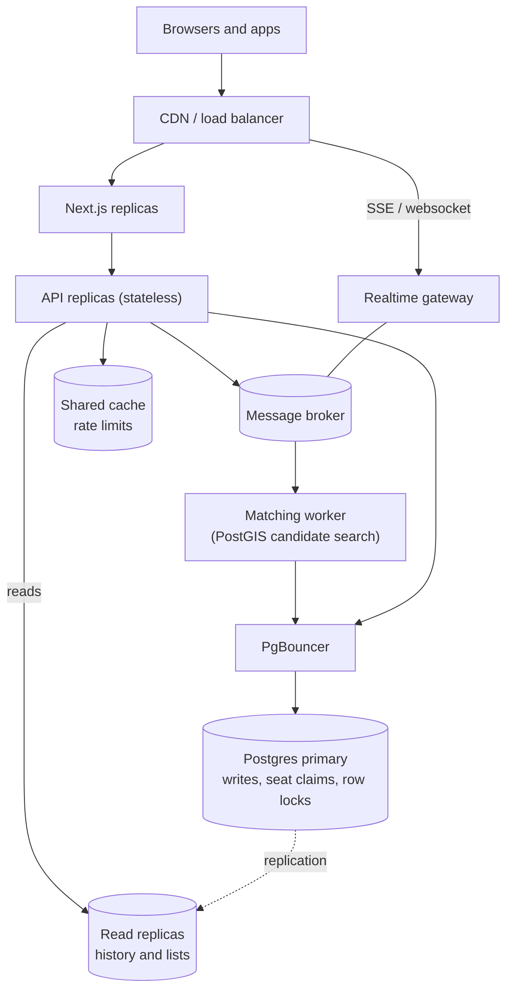

## AI usage

**Tool:** Claude Code (Anthropic) did the implementation, working under written rules for this repository: one logical change per commit, one-line commit messages, tests against a real database, and review of every change before it was committed. Decisions were checked with tests rather than taken on trust. The full log, with dates and commits, is in [AI_NOTES.md](AI_NOTES.md).

Three examples from that log, one of each outcome:

| Outcome | What was on the table | Why |
|---|---|---|
| **Accepted** | A partial unique index so a vehicle can have only one active ride. The assistant flagged it as missing from the spec. | It keeps "one active ride per vehicle" true even when accepts race each other. A violation is mapped to `409 VEHICLE_HAS_ACTIVE_RIDE`, and a test triggers it with a real duplicate insert. |
| **Changed** | Trust one proxy hop (`TRUST_PROXY=1`) so rate limits key on the client IP that Next forwards. | Checking Next's source and what the API actually receives showed that the `/api` rewrite never sets `X-Forwarded-For` and passes a client-sent one through untouched. Trusting it would not have separated users and would have let anyone forge an IP. `TRUST_PROXY` now defaults to false, and login limits are keyed by client IP plus account. |
| **Rejected** | Claim seats with a read followed by a write. | Tried on purpose, temporarily, to check that the last-seat race test can fail: Nusrat and Shirin asking for the last seat at once were both matched (overbooking) and the test failed 4 of 4 runs. The single conditional `UPDATE` stays. |

The log also records three more decisions: a bigint identity on `status_events` for strict event order (accepted), a dummy bcrypt compare so an unknown email takes as long as a wrong password (accepted), and the offline/accept race, where locking only in `accept` failed its race test 6 of 6 and was changed to lock in both places (changed).

## Demo video

[Watch the demo video on Google Drive](https://drive.google.com/file/d/1hPH7zXlHSNkvcnsKhCqQ21oPuTOywFrr/view?usp=sharing)
